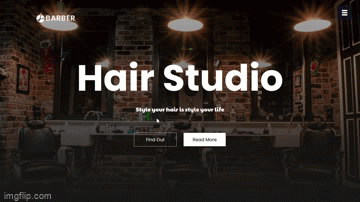

<h1 align="center">Hi 👋, I'm Mohamed</h1>
<h3 align="center">A Full Stack Software Engineer</h3>

- 🌱 I’m currently learning **Golang and gin framework**

- 📫 How to reach me **babekermohamedbab@gmail.com**

<h3 align="left">Connect with me:</h3>

<h3 align="left">Languages and Tools:</h3>

                    

<!-- <h1 align="center">Projects</h1>
<table bordercolor="#66b2b2">
  
  <tr>
    <td width="50%" valign="top">
      <h3 align="center">Travelara.org</h3>
         
        
         
        

          
    
  
      

        
<strong>Javascript, Bootstrap, Sass, Node.js, & Express.js</strong> - Platform to help build momentous milestones along with your friends and family! Travelara makes Dream Trips a Reality!

    </td>
    <td width="50%" valign="top">
      <h3 align="center">Rigley 2: "Flappy Bug"</h3>
         
      
         
        

          
  
  
      

        
<strong>Javascript & Phaser.js</strong> - The awaited sequel sees our Rigley friend jumping through firewalls "Flappy Bird" style.

    </td>
  </tr>
  
  <tr>
    <td width="50%" valign="top">
      <h3 align="center">ShawnCharles.com</h3>
       
        
       
        

  
  
      

        
<strong>HTML5, CSS3, & Javascript</strong> - Portfolio Site including links to my projects and ways to get in contact with me.

    </td>
    <td width="50%" valign="top">
      <h3 align="center">Matching Cards</h3>
         
        
         
        

          
  
  
      

        
<strong>HTML5, CSS3, & Javascript</strong> - With over 100 different cards, test your memory in these three popular trading card themes, Pokemon, Yugioh, & Magic: The Gathering!

    </td>
  </tr>
</table> -->
